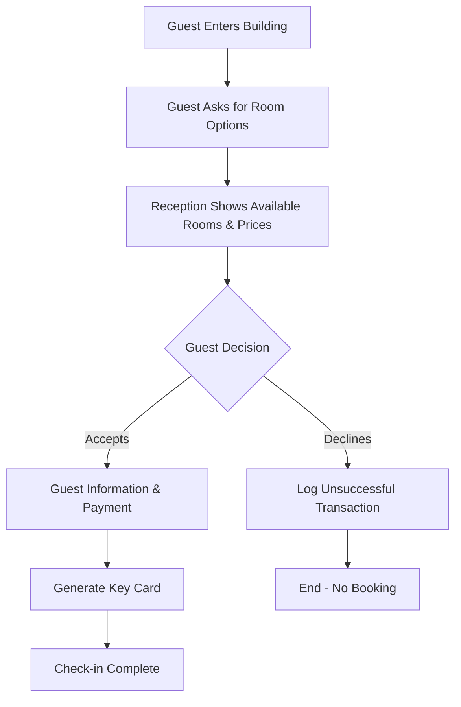

# Walk-in Check-in Flow Storyboard

*Streamlined check-in process for walk-in guests*

---

## 📋 Flow Overview



---

## 🎬 Detailed Storyboard Steps

### Step 1: Guest Arrival
**Action**: New guest enters the building  
**Reception**: Welcome greeting (no system action required)  
**System State**: Ready for new walk-in

```
Reception Script (Thai/English):
"สวัสดีครับ/ค่ะ ยินดีต้อนรับสู่ [Hotel Name]"
"Good morning/afternoon/evening, welcome to [Hotel Name]"
```

---

### Step 2: Room Inquiry
**Action**: Guest asks for room options and current availability  
**Reception Need**: Quick access to real-time room availability and pricing  
**System Requirement**: Live room status dashboard

#### System Display Requirements:
- Available rooms RIGHT NOW (not future dates)
- Room types with current occupancy
- Base prices for each room type
- Quick filter options (room type, floor, view)

#### UI Component: `RoomAvailabilityDashboard.tsx`
```typescript
interface RoomAvailabilityView {
  roomType: string;
  availableCount: number;
  basePrice: number;
  breakfastPrice: number;
  features: string[];
  immediateAvailability: boolean;
}
```

---

### Step 3: Present Options
**Action**: Reception presents available room options with pricing  
**Display**: Room types, prices, breakfast options  
**Key Information**:
- Room type (Standard, Superior, Deluxe, Family)
- Base price per night
- Breakfast option (+400 THB)
- Room features (view, floor, bed type)

#### UI Component: `RoomPresentationCard.tsx`
```typescript
interface RoomOption {
  roomNumber: string;
  roomType: string;
  floor: number;
  basePrice: number;
  breakfastIncluded: boolean;
  breakfastAddOn: number;
  totalPrice: number;
  features: string[];
  photos?: string[];
}
```

#### Presentation Screen Layout:
```
┌─────────────────────────────────────────┐
│         Available Rooms Right Now        │
├─────────────────────────────────────────┤
│ ┌─────────────┐ ┌─────────────┐         │
│ │  STANDARD   │ │  SUPERIOR   │         │
│ │  Room 201   │ │  Room 305   │         │
│ │  1,200 THB  │ │  1,800 THB  │         │
│ │ +Breakfast  │ │ +Breakfast  │         │
│ │  400 THB    │ │  400 THB    │         │
│ └─────────────┘ └─────────────┘         │
│                                          │
│ ┌─────────────┐ ┌─────────────┐         │
│ │   DELUXE    │ │   FAMILY    │         │
│ │  Room 501   │ │  Room 402   │         │
│ │  2,400 THB  │ │  3,200 THB  │         │
│ │ +Breakfast  │ │ +Breakfast  │         │
│ │  400 THB    │ │  400 THB    │         │
│ └─────────────┘ └─────────────┘         │
└─────────────────────────────────────────┘
```

---

### Step 4: Guest Decision Point

#### Path 4.1: Guest Accepts Option
**Action**: Guest chooses a room option  
**System Flow**:
1. Select room and breakfast option
2. Collect guest information
3. Process payment
4. Confirm booking

##### Guest Information Collection (Minimal)
```typescript
interface WalkInGuestInfo {
  firstName: string;
  lastName: string;
  phone: string;
  idType: 'passport' | 'national_id';
  idNumber: string;
  // Optional fields for quick check-in
  email?: string;
  nationality?: string;
}
```

##### Payment Processing
- Cash payment (immediate)
- Credit card (if available)
- Calculate total: Room + Breakfast (if selected) + Taxes
- Generate receipt

#### Path 4.2: Guest Declines All Options
**Action**: Guest not satisfied with available options  
**System Flow**:
1. Log unsuccessful transaction
2. Capture reason (optional)
3. Track for analytics

##### Unsuccessful Transaction Log
```typescript
interface UnsuccessfulWalkIn {
  timestamp: Date;
  requestedRoomType?: string;
  priceObjection?: boolean;
  availabilityIssue?: boolean;
  otherReason?: string;
  staffId: string;
}
```

---

### Step 5: Key Card Generation
**Action**: Generate key card for confirmed guest  
**System Requirements**:
- Auto-generate key card number
- Set access permissions for room
- Set expiry for checkout date
- Print/encode physical card

#### Key Card Component: `KeyCardGenerator.tsx`
```typescript
interface KeyCardGeneration {
  bookingId: string;
  guestName: string;
  roomNumber: string;
  cardNumber: string; // Auto-generated
  activationTime: Date;
  expiryTime: Date;
  accessLevel: 'room_only' | 'room_and_facilities';
}
```

---

## 🔄 Simplified System Flow

### Technical Implementation Steps

1. **Room Availability Service Enhancement**
```typescript
class RoomAvailabilityService {
  // Get rooms available RIGHT NOW
  getImmediateAvailability(): Promise<RoomAvailability[]> {
    // Check rooms that are:
    // - Status: 'clean_and_ready'
    // - Not reserved for today
    // - Not under maintenance
  }
  
  // Quick price calculation
  calculateRoomPrice(roomType: string, includeBreakfast: boolean): PriceBreakdown {
    // Base price + breakfast + taxes
    // Return itemized breakdown
  }
}
```

2. **Streamlined Walk-in Component**
```typescript
const WalkInCheckIn: React.FC = () => {
  // Step 1: Show available rooms
  // Step 2: Guest selection
  // Step 3: Quick info collection
  // Step 4: Payment
  // Step 5: Key card
  
  const steps = [
    'Room Selection',
    'Guest Information',
    'Payment',
    'Key Card'
  ];
}
```

3. **Analytics Tracking**
```typescript
class WalkInAnalytics {
  // Track successful walk-ins
  logSuccessfulWalkIn(booking: Booking): void;
  
  // Track unsuccessful attempts
  logUnsuccessfulAttempt(reason: UnsuccessfulReason): void;
  
  // Generate reports
  getConversionRate(): number;
  getCommonObjections(): ObjectionReport;
}
```

---

## 💻 UI Components Needed

### Priority 1: Core Flow Components
1. **RoomAvailabilityDashboard.tsx** - Real-time room status
2. **RoomSelectionGrid.tsx** - Visual room selection
3. **QuickGuestForm.tsx** - Minimal info collection
4. **PaymentQuickProcess.tsx** - Fast payment handling
5. **KeyCardQuickGenerate.tsx** - Instant key creation

### Priority 2: Supporting Components
1. **UnsuccessfulTransactionLog.tsx** - Track declined bookings
2. **PriceCalculator.tsx** - Real-time price display
3. **BreakfastOptionToggle.tsx** - Add/remove breakfast
4. **WalkInReceipt.tsx** - Simple receipt generation

---

## 🎯 Key Differences from Original Plan

### Simplified Approach
1. **No advance booking** - Only "right now" availability
2. **Minimal guest info** - Just essentials for legal compliance
3. **Quick payment** - Streamlined process
4. **Immediate key card** - No delays
5. **Analytics tracking** - Log unsuccessful attempts

### Removed Complexity
- No future date selection
- No extended guest profiling
- No loyalty program enrollment
- No special requests handling
- No room preferences beyond type

---

## 📊 Success Metrics

### Speed Metrics
- **Total check-in time**: < 3 minutes
- **Room selection**: < 30 seconds
- **Payment processing**: < 1 minute
- **Key card generation**: < 30 seconds

### Conversion Metrics
- **Walk-in conversion rate**: Track accept vs decline
- **Reason for decline**: Price, availability, other
- **Peak walk-in times**: Hourly analytics
- **Room type preferences**: Most requested

### Operational Metrics
- **System response time**: < 1 second
- **Availability accuracy**: 100%
- **Payment success rate**: > 99%
- **Key card generation success**: 100%

---

## 🚀 Implementation Priority

### Phase 1: Core Flow (Week 1)
- [ ] RoomAvailabilityDashboard
- [ ] RoomSelectionGrid
- [ ] QuickGuestForm
- [ ] Basic payment processing

### Phase 2: Complete Flow (Week 2)
- [ ] KeyCardQuickGenerate
- [ ] WalkInReceipt
- [ ] UnsuccessfulTransactionLog
- [ ] Analytics dashboard

### Phase 3: Optimization (Week 3)
- [ ] Performance tuning
- [ ] UI/UX improvements
- [ ] Staff training materials
- [ ] Testing and refinement

---

*This streamlined storyboard focuses on speed, simplicity, and conversion tracking for walk-in guests.*